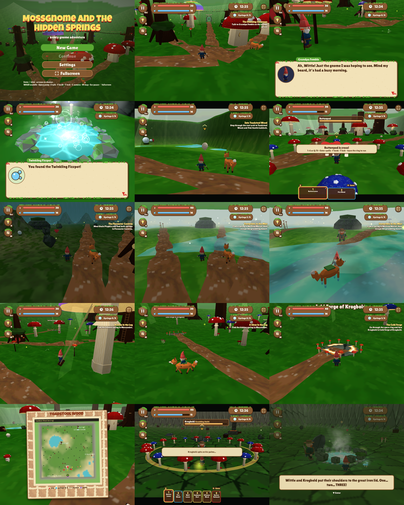

# Mossgnome and the Hidden Springs

A cozy N64-style gnome adventure: waddle around the mushroom village of Mossunder, ride Tansy the fox, and find the eight
hidden bubbly springs behind waterfalls, in mossy caves, at the end of root tunnels and inside hollow logs. Then make friends with a grumpy dwarf.

**Play:** https://unclebill-spec.github.io/mossgnome/ (computer, phone or tablet with WebGL; Bluetooth / USB controllers work too; tap or press a key once for sound)

## Controls
The on-screen prompts switch automatically to whatever you used last (keyboard & mouse, controller or touch). All three schemes are listed in the pause menu under **Controls**; **Settings** has camera mode, sensitivity, invert Y, mouse look, auto Target Lock, **Minimap** and **Quest hint arrow** (saved on the device), plus **Install app** (Android: the install prompt; iPhone: the Add to Home Screen steps).

The round Pause / Hint / Map / Camera buttons and the clock sit in one row along the bottom of the screen (on a phone, between the thumbstick and the action buttons). The fullscreen button is at the far left, with the small HP/MP bars beside it.

| Action | Keyboard & mouse | Controller (Xbox / PlayStation / Switch Pro / standard) | Touch |
|---|---|---|---|
| Waddle | WASD / arrows (Shift: walk / run) | left stick (click: walk) | slide a thumb on the left third |
| Camera | mouse drag, or click-to-lock mouse look; wheel zooms | right stick | drag on the right side |
| Camera mode (Follow / Free) | C | R3 (right-stick click) | camera button |
| Target Lock (face + circle a critter) | T / middle-click | LT / L2 / ZL | reticle button |
| Jump | Space | A / ✕ / B | arrow button |
| Talk / use | E / right-click / Enter | Y / △ / X | hand button |
| Hat bonk | F / left-click | X / □ / Y | hat button |
| Spells (in a battle ring) | 1-6, or Q / R / wheel to pick + Enter | LB / RB to pick + RT | spell tiles / sparkle button |
| Ride the fox | R | D-pad down | paw button |
| Map / hint | M or Tab / H | Select / D-pad up | map / bulb buttons |
| Pause / back | Esc | Start / B | pause button |
| Fullscreen | ` (backtick), corner button, title / Settings | Start + Select | corner button (iPhone: Add to Home Screen) |

Follow camera swings in behind you as you go (nudge it any time; it eases back after a moment). Free camera only moves when you move it.
Push the camera up (drag up, mouse up, or right stick up) to look high into the treetops; in Follow it holds while you stand and eases back once you walk on.

**Minimap:** a little parchment disc in the top-right corner shows the nearby paths, houses, friends and gates, with your red arrow showing which way you face. A red chevron on its rim nudges you the general way toward your current quest step (or the gate that leads there). When you get there, the chevron hides and an orange dot marks the spot. Both can be turned off in Settings.
Target Lock grabs a cross critter when you get close (or press the lock control): you face it, strafe round it, the letterbox bars slide in; press again to switch targets or let go. Step out of a battle ring to run away.

## Phones, fullscreen and display
- Made for a **sideways phone**: the picture fills the whole screen (around notches and the home bar), the stick sits bottom-left and the buttons bottom-right. Held upright, it asks you to turn the phone (or you can keep playing in a smaller strip).
- **Fullscreen:** the corner button, **Fullscreen** on the title screen or in Settings, or the ` key. Android also locks to landscape. iPhone Safari can't make a page fullscreen, so use **Share → Add to Home Screen**: the home-screen icon opens the game fullscreen and sideways (the game explains this once).
- **Settings → Display:** *Auto* (phone resolution on touch devices, otherwise matches the window), *Phone (landscape)*, *720p TV/PC*, *1080p TV/PC* (bigger, sofa-readable HUD and controller-first prompts) or *Retro 320x240* (authentic N64 low res, chunky pixels). **Aspect:** Fit screen / 16:9 / 4:3 (black bars). **Render scale** 50-100% if a device runs slow. Changes apply instantly and are remembered.

## Day and night
- The world runs a day/night cycle (about 20 minutes per day). The clock in the bottom row shows the time.
- At night, torches (some burn blue cold fire), glow-fish lanterns, wisps, fireflies and butterflies light the way, and every hidden spring glows.
- **Settings → Time of day:** *Cycle*, *Always day* or *Always night*. **Settings → Lighting:** *Auto* (picks for your device and steps down if it runs slow), *Low*, *Medium* or *High*.
- In the village, the pause menu has **Rest until nightfall / morning**.

Progress saves to your browser (localStorage): pick **Continue** on the title screen.

Developer tools (scene picker, texture filter toggle, spell VFX page) are hidden; add `?debug=1` to the URL to show them.

Generated with n64-suite (seed 64). Third-party components and their licenses: see [THIRD_PARTY_LICENSES.md](THIRD_PARTY_LICENSES.md).
